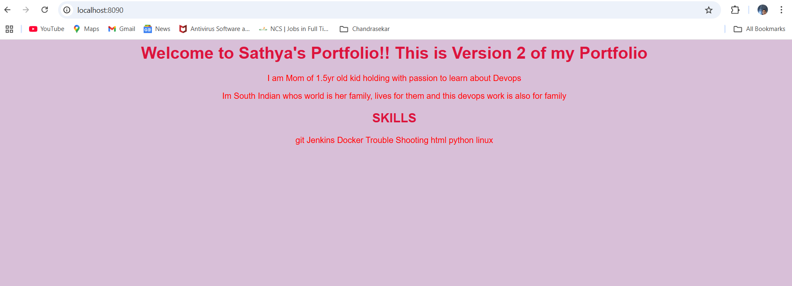

# 🖥️ Sathya's Portfolio Project (Dockerized)




This is a sample portfolio website created using HTML and styled with CSS. It is containerized using Docker and can run in both development and production environments.

---

## 📁 Project Structure

portfolio_project/ 
│ 
├── site/
│ ├── index.html # Webpage content 
│ └── styles.css # Webpage styling 
│ 
├── docker-compose.yml # Production setup using named volumes
├── docker-compose.dev.yml # Development setup using bind mount
├── README.md # You're reading it!

---

### 🚀 How to Run This Project

✅ Development Mode (Bind Mount)
- Live edit the HTML/CSS files
- Changes reflect instantly

```bash
docker compose -f docker-compose.dev.yml up -d

📍 Accessible at: http://localhost:8091

✅ Production Mode (Named Volume)
Runs from a fixed image

```bash
docker compose -f docker-compose.yml up -d
📍 Accessible at: http://localhost:8090

#### 📚 Key Differences
Concept 	Development		Production
Volume Type		Bind mount 	(linked to site/ folder)	Named volume (separate internal data)
Image		Uses local file system directly	Uses image pulled from Docker Hub
Container		Reflects live changes instantly	Requires rebuild for updates
Purpose	Fast testing & editing	Stable deployment environment

---

## 🐳 Running from Docker Hub Image

You can also run the portfolio container directly from Docker Hub using the following steps:

### 🔁 Steps to Pull and Run from Docker Hub

1. **Remove old image (if needed):**
   ```bash
   docker rmi pillaisathya/portfolio:v2
   
2. Pull the latest image from Docker Hub:
docker pull pillaisathya/portfolio:v2

3. Run the container by mapping it to a local port:
docker run -d -p 8090:80 --name portfolio_from_hub pillaisathya/portfolio:v2

Visit the webpage: http://localhost:8090

---

🧠 Tip: If you face a port error or name conflict, stop or remove the existing container using:

bash
docker ps
docker stop <container_name>
docker rm <container_name>


